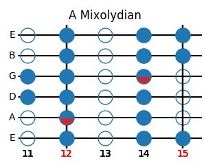
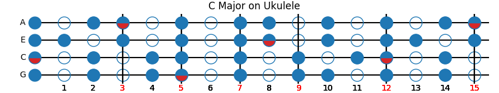

# scales

A tool to generate stringed instrument visual aids

* [Installation](#installation)
* [Usage](#usage)
  * [Other helpful uses](#other-helpful-uses)
* [Dependencies](#dependencies)

## Installation
Install using:

```
pip install scales.py
```

Then import it like so:

```py
from scales import Scales
```

## Usage
Scales objects take at least the `scale` parameter, which should be a list of notes (the first note is treated as the root). They can be drawn using the `draw` function, where `start` and `stop` are the range of frets to show (defaults to showing 15 frets if not specified).

For example:

```py
a_mixo = ['A', 'B', 'C#', 'D', 'E', 'F#', 'G']
six_string = Scales(title='A Mixolydian', scale=a_mixo)
six_string.draw(start=11, stop=15)
```



By default, it will assume a 6 string guitar in standard tuning, but you can specify other tunings like:

```py
c_major = ['C', 'D', 'E', 'F', 'G', 'A', 'B']
ukulele = Scales(title='C Major on Ukulele', strings=['G', 'C', 'E', 'A'], scale=c_major)
ukulele.draw()
```



Scales can be drawn without making it an object:

```py
g_chord = ['G', 'B', 'D']
Scales(title='Open G', scale=g_chord).draw(stop=3)
```


### Other helpful uses

Scales can be used to generate blank visuals to print out. Heres a blank 6 string fretboard:

```py
Scales([]).draw()
```

Or a blank open chord chart:

```py
Scales([]).draw(stop=3)
```

## Dependencies

Library | Description
--- | ---
[matplotlib](https://matplotlib.org) | 2D plotting library
[numpy](https://numpy.org) |  Fundamental package for scientific computing